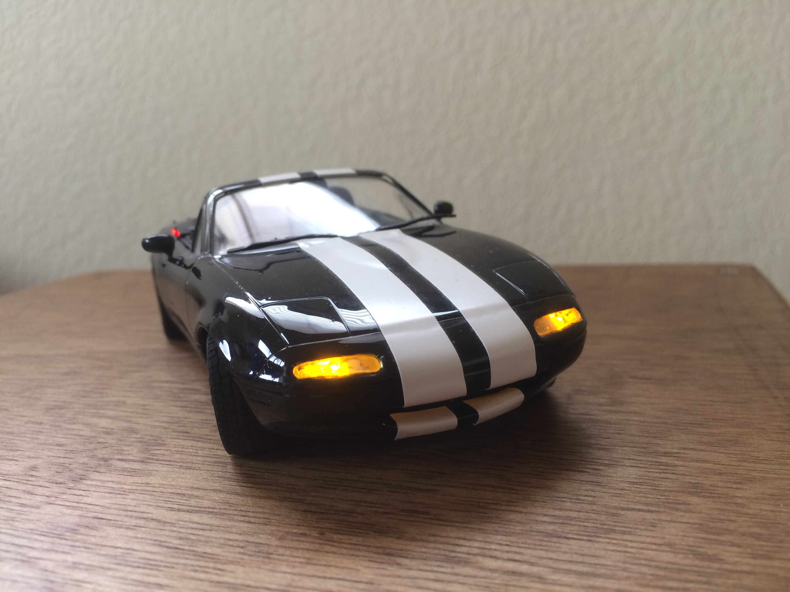
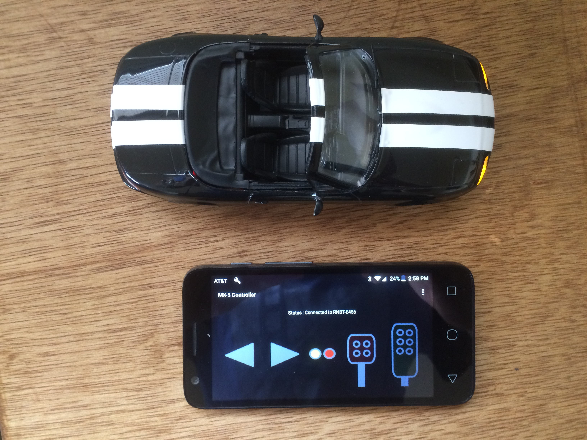
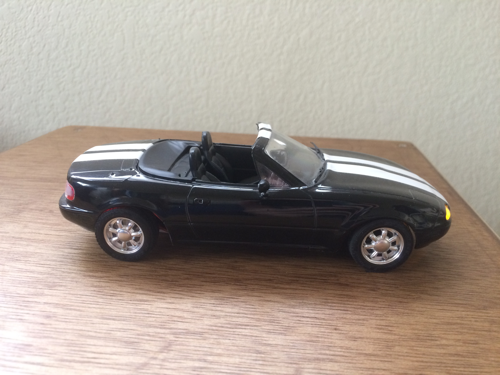
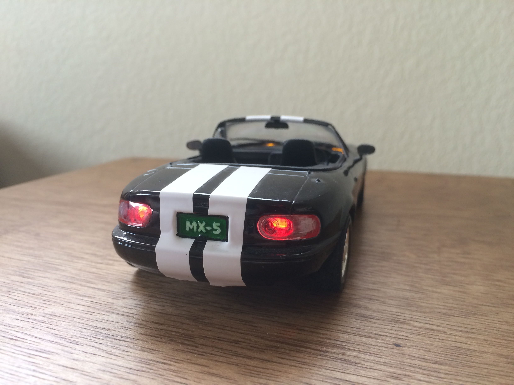

# RCMazdaMiata
Project by Matthew Chamot

Arduino code and CAD for a remote-controlled scale model of a Mazda Miata.

After building a few plastic model cars, I wished they could actually move and I could race them around like an RC car.  This project does exactly that.  A 1:24 scale model of a Mazda Miata had its plastic engine swapped with an electric motor and it was off to the races.

#### Description
The RC Mazda Miata utilizes a small DC gearmotor for driving, sub-mirco servo for steering, and a Bluetooth module for communication.  The processing power comes from a Teensy LC which handles the signals from the controller. The controller in this case was a simple android phone that sends the commands via Bluetooth. The car also incorporates working headlights and taillights, an embedded charging circuit beneath the license plate, and everything still fits under the body of the original model. 

